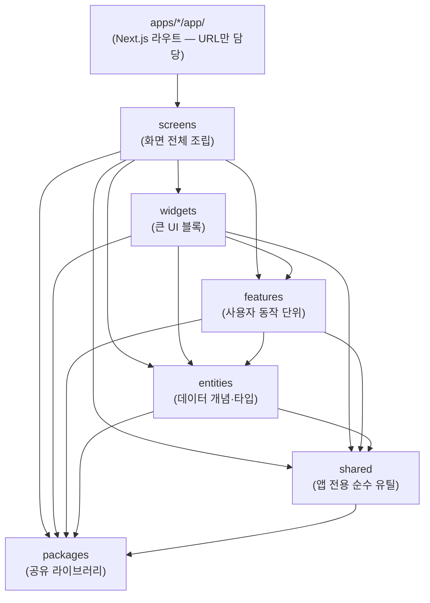
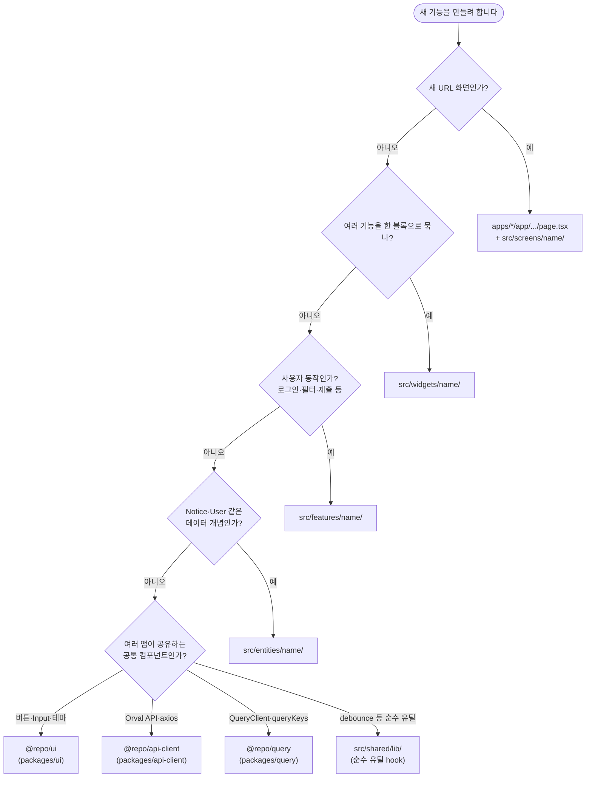

# sample

> 멀티 Next.js 앱(`web`, `admin`) + 공유 패키지 Monorepo (React **19.2.1**, Next **16.1.0**)

---

## 이 프로젝트는 무엇인가요?

이 프로젝트는 **Monorepo** 구조로 만들어진 Next.js 웹 애플리케이션입니다.

### Monorepo란?

일반적인 프로젝트는 앱 코드 하나가 하나의 Git 저장소에 있습니다.  
Monorepo는 **하나의 Git 저장소 안에 여러 패키지**를 함께 관리하는 방식입니다.

```
일반 구조:          Monorepo 구조:
my-app/             next-tanstack-monorepo/
  src/                apps/
  package.json          web/        ← 사용자 서비스 앱
                        admin/      ← 관리자 서비스 앱
                      packages/     ← 공유 라이브러리들
                        ui/         ← 공통 UI 컴포넌트
                        api-client/ ← API 호출 코드
                        query/      ← 서버 상태 설정
```

**장점:** 공통 코드(UI, API, 타입)를 한 곳에서 관리하고 여러 앱이 공유할 수 있습니다.

현재 프로젝트는 `apps/web`, `apps/admin` 두 개의 Next.js 앱을 사용합니다.  
공통 코드(UI, API, Query, 타입)는 `packages/*`로 분리해 중복 없이 재사용합니다.

---

## 목차

1. [처음 시작하기 (온보딩 체크리스트)](#1-처음-시작하기-온보딩-체크리스트)
2. [주요 라이브러리 버전](#2-주요-라이브러리-버전)
3. [권장 VSCode 확장 프로그램](#3-권장-vscode-확장-프로그램)
4. [ESLint / Prettier 설정](#4-eslint--prettier-설정)
5. [폴더 구조](#5-폴더-구조)
6. [FSD 아키텍처 이해하기](#6-fsd-아키텍처-이해하기)
7. [명명 규칙](#7-명명-규칙-naming-convention)
8. [코드 연결 흐름 예제](#8-예제-지금-코드가-어떻게-연결되는지)
9. [실전 샘플: 공지사항 기능 만들기](#9-실전-샘플-공지사항-기능을-처음부터-만든다면)
10. [Zod — 런타임 스키마 검증](#10-zod--런타임-스키마-검증)
11. [Zustand — 클라이언트 상태 관리](#11-zustand--클라이언트-상태-관리)
12. [MDI 탭 시스템](#12-mdi-탭-시스템)
13. [새 기능 넣을 때 체크리스트](#13-새-기능-넣을-때-체크리스트)
14. [환경 변수 (env) 규칙](#14-환경-변수-env-규칙)
15. [스크립트 목록](#15-스크립트)
16. [새 앱 추가하기](#16-새-앱-추가하기)

---

## 1. 처음 시작하기 (온보딩 체크리스트)

처음 프로젝트를 받았다면 아래 순서대로 따라하세요.

### Step 1 — Node.js 설치 확인

Node.js 20 이상이 필요합니다. 터미널에서 버전을 확인하세요.

```bash
node -v   # v20.x.x 이상이어야 합니다
```

설치가 필요하다면 [nodejs.org](https://nodejs.org/)에서 LTS 버전을 설치하세요.

### Step 2 — pnpm 설치

이 프로젝트는 패키지 매니저로 **pnpm**을 사용합니다.  
(`npm`보다 빠르고, Monorepo 환경에 더 적합합니다.)

```powershell
# corepack을 이용한 설치 (권장)
corepack enable
corepack prepare pnpm@10.26.1 --activate

# 또는 npm으로 직접 설치
npm install -g pnpm@latest-11
```

### Step 3 — 의존성 설치

프로젝트 루트에서 한 번만 실행하면 모든 패키지의 의존성이 설치됩니다.

```bash
pnpm install
```

### Step 4 — VSCode 확장 프로그램 설치

[아래 권장 확장 프로그램 목록](#3-권장-vscode-확장-프로그램)을 참고해서 설치하세요.

### Step 5 — 개발 서버 실행

```bash
pnpm dev
```

`pnpm dev`는 `web(3000)` + `admin(3001)`을 함께 실행합니다.

- web만 실행: `pnpm dev:web`
- admin만 실행: `pnpm dev:admin`

브라우저:
- web: [http://localhost:3000](http://localhost:3000)
- admin: [http://localhost:3001](http://localhost:3001)

### Step 6 — md 파일 뷰어

README 같은 마크다운 파일을 보기 좋게 렌더링하려면 VSCode에서 **MarkMaid View** 확장 프로그램을 설치하세요.

---

## 2. 주요 라이브러리 버전

| 분류                | 라이브러리                   | 버전        | 한 줄 설명 |
| ------------------- | ---------------------------- | ----------- | ---------- |
| **런타임**          | Node.js                      | `>=20`      | JavaScript 실행 환경 |
| **패키지 매니저**   | pnpm                         | `10.26.1`   | 빠른 패키지 설치, Monorepo 지원 |
| **빌드**            | Turbo                        | `^2.8.0`    | Monorepo 병렬 빌드 도구 |
| **프레임워크**      | Next.js                      | `16.1.0`    | React 기반 풀스택 웹 프레임워크 |
| **UI**              | React                        | `19.2.1`    | UI 컴포넌트 라이브러리 |
| **UI**              | React DOM                    | `19.2.1`    | React를 브라우저 DOM에 렌더링 |
| **UI 컴포넌트**     | MUI (Material UI)            | `^7.3.11`   | 구글 Material Design 기반 UI 컴포넌트 모음 |
| **UI 컴포넌트**     | MUI Icons                    | `^7.3.11`   | MUI 전용 아이콘 세트 |
| **스타일**          | Emotion React                | `^11.14.0`  | CSS-in-JS 스타일링 (MUI 내부 사용) |
| **스타일**          | Emotion Styled               | `^11.14.1`  | styled-components 방식의 Emotion API |
| **서버 상태**       | TanStack Query (React Query) | `^5.100.14` | API 데이터 조회/캐싱/동기화 관리 |
| **HTTP 클라이언트** | Axios                        | `^1.16.1`   | HTTP 요청 라이브러리 (fetch 대체) |
| **코드 생성**       | Orval                        | `^8.12.3`   | OpenAPI 스펙으로 API 클라이언트 코드 자동 생성 |
| **스키마 검증**     | Zod                          | `^4.4.3`    | 런타임 데이터 유효성 검증 및 TypeScript 타입 추론 |
| **폼**              | React Hook Form              | `^7.77.0`   | 성능 최적화된 폼 상태 관리 |
| **폼**              | @hookform/resolvers          | `^5.4.0`    | React Hook Form + Zod 연결 어댑터 |
| **차트**            | ECharts                      | `^6.1.0`    | Apache 오픈소스 차트 라이브러리 |
| **차트**            | echarts-for-react            | `^3.0.6`    | ECharts의 React 래퍼 |
| **클라이언트 상태** | Zustand                      | `^5.0.14`   | 가볍고 간단한 전역 상태 관리 |
| **스토리북**        | Storybook                    | `10.4.1`    | UI 컴포넌트 독립 개발 및 문서화 도구 |
| **언어**            | TypeScript                   | `^5.8.3`    | JavaScript에 타입 시스템을 추가한 언어 |
| **린터**            | ESLint                       | `^9.28.0`   | 코드 품질 규칙 검사 |
| **포매터**          | Prettier                     | `^3.8.3`    | 코드 스타일 자동 정렬 |

---

## 3. 권장 VSCode 확장 프로그램

VSCode 왼쪽 사이드바의 **Extensions** 탭(`Ctrl+Shift+X`)에서 아래 확장 프로그램 ID를 검색해 설치하세요.

| 확장 ID                  | 이름       | 설명                                             |
| ------------------------ | ---------- | ------------------------------------------------ |
| `dbaeumer.vscode-eslint` | ESLint     | JS/TS 린팅 규칙 적용                             |
| `esbenp.prettier-vscode` | Prettier   | 코드 자동 포매팅                                 |
| `eamodio.gitlens`        | GitLens    | Git blame, 히스토리, 브랜치 등 강력한 Git 시각화 |
| `usernamehw.errorlens`   | Error Lens | 에러/경고를 해당 코드 줄에 인라인으로 표시       |

---

## 4. ESLint / Prettier 설정

> **ESLint**는 잘못된 코드 패턴을 잡아주는 검사기, **Prettier**는 코드 스타일을 자동으로 맞춰주는 포매터입니다.  
> 둘이 충돌하지 않도록 함께 설정합니다.

### 1. 확장 프로그램 설치

VSCode 확장 프로그램 탭에서 아래 두 가지를 검색하여 설치합니다.

- `dbaeumer.vscode-eslint` — ESLint
- `esbenp.prettier-vscode` — Prettier

### 2. 패키지 설치

프로젝트 루트에서 실행합니다.

```bash
pnpm add -D prettier eslint-config-prettier
```

### 3. `.prettierrc` 생성 (프로젝트 루트)

```json
{
  "semi": true,
  "singleQuote": false,
  "tabWidth": 2,
  "trailingComma": "es5",
  "printWidth": 100,
  "endOfLine": "lf"
}
```

### 4. `eslint.config.mjs` 수정

`eslint-config-prettier`를 가장 마지막에 추가해야 Prettier와 충돌하는 ESLint 규칙이 비활성화됩니다.

```js
import { defineConfig, globalIgnores } from "eslint/config";
import nextVitals from "eslint-config-next/core-web-vitals";
import nextTs from "eslint-config-next/typescript";
import prettier from "eslint-config-prettier";

const eslintConfig = defineConfig([
  ...nextVitals,
  ...nextTs,
  prettier, // ← 반드시 마지막에 위치
  globalIgnores([
    ".next/**",
    "out/**",
    "build/**",
    "next-env.d.ts",
    "node_modules/**",
    "packages/**/node_modules/**",
    "packages/ui/storybook-static/**",
    "**/*.tsbuildinfo",
  ]),
]);

export default eslintConfig;
```

### 5. `.vscode/settings.json` 생성 (프로젝트 루트)

```json
{
  "eslint.useFlatConfig": true,
  "eslint.validate": ["javascript", "javascriptreact", "typescript", "typescriptreact"],
  "editor.defaultFormatter": "esbenp.prettier-vscode",
  "editor.formatOnSave": true,
  "editor.codeActionsOnSave": {
    "source.fixAll.eslint": "explicit"
  },
  "[javascript]": { "editor.defaultFormatter": "esbenp.prettier-vscode" },
  "[javascriptreact]": { "editor.defaultFormatter": "esbenp.prettier-vscode" },
  "[typescript]": { "editor.defaultFormatter": "esbenp.prettier-vscode" },
  "[typescriptreact]": { "editor.defaultFormatter": "esbenp.prettier-vscode" }
}
```

> 설정 후 VSCode를 재시작하거나 `Ctrl+Shift+P` → **ESLint: Restart ESLint Server** 를 실행합니다.

---

## 5. 폴더 구조

`apps/*`에 앱을 두고, 공통 코드는 `packages/*`로 분리합니다.

```
next-tanstack-monorepo/
├── apps/
│   ├── web/                # 사용자 앱 (Next.js)
│   │   ├── app/            # 라우트
│   │   └── src/            # FSD
│   └── admin/              # 관리자 앱 (Next.js)
│       ├── app/            # 라우트
│       └── src/            # FSD
├── public/
├── packages/               # 공유 라이브러리 (여러 앱이 함께 쓸 수 있는 코드)
│   ├── api-client/         # Orval + Axios로 생성된 API 호출 코드
│   ├── query/              # TanStack Query 설정 및 QueryClient
│   ├── ui/                 # MUI, ECharts, QCELL, Storybook
│   ├── types/              # 공통 TypeScript 타입 및 Zod 스키마
│   └── config-typescript/  # 공통 tsconfig 설정
├── package.json            # 루트 패키지 설정 (워크스페이스 루트)
├── pnpm-workspace.yaml     # pnpm 워크스페이스 패키지 목록
├── .env.*                  # 공통 환경변수 (런타임 + codegen)
└── turbo.json              # Turborepo 빌드 파이프라인 설정
```

---

## 6. FSD 아키텍처 이해하기

### FSD(Feature-Sliced Design)란?

> **"레고 블록처럼 기능을 조립하는 폴더 구조 방법론입니다."**

FSD는 코드를 **레이어(layer)** 라는 역할별 폴더로 나누고, **위에서 아래 방향으로만** 의존하게 만드는 규칙입니다.

일반적인 프로젝트에서는 어떤 파일이 어느 파일을 import해도 제한이 없어서 코드가 점점 복잡하게 엉킵니다.  
FSD는 이런 "스파게티 코드"를 방지하기 위해 **방향성 있는 의존 규칙**을 강제합니다.

### 레이어 의존 방향

아래로만 import 가능합니다. 위 레이어가 아래 레이어를 사용합니다.



**핵심 규칙:** 같은 레이어끼리는 import하지 않습니다.
- `features/auth` → `features/cart` ❌ (같은 features 레이어끼리 금지)
- 필요하다면 `widgets` 또는 `screens`에서 두 feature를 조합합니다.

### 레이어별 역할

| 레이어             | 역할                                                                        | 이 프로젝트 예시                                            |
| ------------------ | --------------------------------------------------------------------------- | ------------------------------------------------------- |
| `apps/*/app/` (Next.js) | URL, `layout`, `metadata`. 비즈니스 로직 없음                          | `apps/web/app/(main)/page.tsx` → `@/screens/home` re-export |
| `src/application/` | FSD app 레이어 — Provider, 초기화                                           | `AppProviders` (MUI + Query + Theme)                    |
| `src/screens/`     | **한 라우트 화면** 조립. FSD의 pages 레이어                                 | `home`, `notice`, `qna`                                 |
| `src/widgets/`     | 여러 feature/entity를 묶은 **큰 UI 블록**                                   | `demoDashboard`, `boardNav`                             |
| `src/features/`    | **사용자가 하는 동작 하나**. UI + 그 동작에 필요한 상태·API 호출을 묶음     | `demoForm`(폼 제출), `apiPlayground`(엔드포인트 테스트) |
| `src/entities/`    | **앱이 다루는 핵심 데이터 단위**. 타입·모델만 가짐. feature에서 조립해서 씀 | `notice`(공지 타입), `qna`(QnA 타입)                    |
| `src/shared/`      | 도메인 없는 앱 전용 유틸                                                    | `shared/config/routes.ts`                               |
| `packages/*`       | 멀티앱·인프라급 공통 (FSD shared 확장)                                      | `@repo/ui`, `@repo/api-client`, `@repo/query`           |

> **왜 `screens`인가?** Next.js는 `src/pages/`를 Pages Router로 인식합니다. FSD의 pages 레이어 이름 충돌을 피하기 위해 `screens`로 사용합니다.

### features vs entities 구분법

> - `entities` = **"무엇(What)"** — 데이터가 어떻게 생겼는가 (User, Notice의 타입·모델)
> - `features` = **"어떻게(How)"** — 사용자가 그 데이터로 무엇을 하는가 (로그인, 글쓰기, 검색)

### Slice 안 segment (폴더 역할)

기능/엔티티 폴더(slice) 안에서는 **파일 종류**별로 segment를 둡니다.

| segment  | 넣는 것                    | 예시                                                           |
| -------- | -------------------------- | -------------------------------------------------------------- |
| `ui/`    | React 컴포넌트             | `features/demoForm/ui/DemoFormPanel.tsx`                       |
| `model/` | hook, store, 비즈니스 상태 | `entities/notice/model/types.ts`, (추가 시) `useNoticeList.ts` |
| `api/`   | API 호출·Orval 래핑        | (추가 시) `features/noticeList/api/getNotices.ts`              |
| `lib/`   | slice **내부만** 쓰는 헬퍼 | slice 전용 포맷터 등                                           |

외부에서는 slice의 **`index.ts`(public API)** 만 import 합니다.

```ts
// ✅ 올바른 방법 — index.ts를 통해 import
import { DemoFormPanel } from "@/features/demoForm";

// ❌ 잘못된 방법 — 내부 파일을 직접 import
import { DemoFormPanel } from "@/features/demoForm/ui/DemoFormPanel";
```

### Import 허용 표

| from ↓ / to → | screens | widgets | features | entities | shared          | packages |
| ------------- | ------- | ------- | -------- | -------- | --------------- | -------- |
| **screens**   | —       | ✅      | ✅       | ✅       | ✅              | ✅       |
| **widgets**   | ❌      | —       | ✅       | ✅       | ✅              | ✅       |
| **features**  | ❌      | ❌      | —        | ✅       | ✅              | ✅       |
| **entities**  | ❌      | ❌      | ❌       | —        | ✅              | ✅       |
| **shared**    | ❌      | ❌      | ❌       | ❌       | slice 간 최소화 | ✅       |

> 도메인 hook·API는 `shared`가 아니라 **해당 feature/entity의 `model/`·`api/`** 에 둡니다.

### Custom Hook 위치 기준 (CRUD별)

hook은 **읽기냐 / 쓰기냐**에 따라 위치가 달라집니다.

| 동작               | 성격                                        | 위치                     |
| ------------------ | ------------------------------------------- | ------------------------ |
| `GET` 조회         | 데이터를 읽기만 함 — 여러 레이어에서 재사용 | `entities/{name}/model/` |
| `POST` 등록        | 사용자가 행동을 일으킴                      | `features/{name}/model/` |
| `PUT / PATCH` 수정 | 사용자가 행동을 일으킴                      | `features/{name}/model/` |
| `DELETE` 삭제      | 사용자가 행동을 일으킴                      | `features/{name}/model/` |

```
entities/
  notice/
    model/
      useNoticeList.ts    ← GET 목록 조회 ✅
      useNoticeDetail.ts  ← GET 상세 조회 ✅

features/
  noticeCreate/
    model/
      useNoticeCreate.ts  ← POST 등록 ✅
  noticeEdit/
    model/
      useNoticeEdit.ts    ← PUT 수정 ✅
  noticeDelete/
    model/
      useNoticeDelete.ts  ← DELETE 삭제 ✅
```

> **조회 hook을 entities에 두는 이유:** screens, widgets, features 어디서든 공통으로 재사용되기 때문입니다.  
> **등록·수정·삭제 hook을 features에 두는 이유:** 특정 사용자 행동(폼 제출, 버튼 클릭)에 종속되어 해당 feature 안에서만 쓰이기 때문입니다.

### Path alias (`tsconfig.json`)

긴 상대 경로(`../../`) 대신 아래 별칭을 사용합니다.

| alias           | 실제 경로          |
| --------------- | ----------------- |
| `@/screens/*`   | `src/screens/*`   |
| `@/widgets/*`   | `src/widgets/*`   |
| `@/features/*`  | `src/features/*`  |
| `@/entities/*`  | `src/entities/*`  |
| `@/shared/*`    | `src/shared/*`    |
| `@/application` | `src/application` |

---

## 7. 명명 규칙 (Naming Convention)

| 대상                        | 규칙                                | 예시                                           |
| --------------------------- | ----------------------------------- | ---------------------------------------------- |
| **폴더 (slice 이름)**       | camelCase                           | `qnaCreate/`, `apiPlayground/`, `zustandDemo/` |
| **React 컴포넌트 파일**     | PascalCase                          | `QnaCreateForm.tsx`, `AppHeader.tsx`           |
| **훅 파일**                 | camelCase (`use` 접두사 유지)       | `useQnaForm.ts`, `useTabState.ts`              |
| **스토어 / 모델 파일**      | camelCase                           | `volatileStore.ts`, `persistentStore.ts`       |
| **타입 / 설정 / 유틸 파일** | camelCase                           | `types.ts`, `routes.ts`                        |
| **배럴 파일**               | 항상 `index.ts` 고정                | `index.ts`                                     |
| **Next.js 예약 파일**       | Next.js 규약 유지 (변경 불가)       | `page.tsx`, `layout.tsx`, `globals.css`        |
| **CSS 모듈**                | 컴포넌트와 동일한 이름, 소문자 유지 | `qcell.module.css`                             |

**요약: 폴더 camelCase · 컴포넌트 PascalCase · 그 외 camelCase**

```
src/features/
└── qnaCreate/                  ← 폴더: camelCase
    ├── model/
    │   └── useQnaForm.ts       ← 훅: camelCase
    ├── ui/
    │   └── QnaCreateForm.tsx   ← 컴포넌트: PascalCase
    └── index.ts                ← 배럴: 항상 index.ts
```

> **왜 이 규칙인가?**
>
> - 폴더 이름에 하이픈(`-`)이 포함되면 일부 도구(ESLint import 플러그인, shell 등)에서 따옴표 처리가 필요합니다. camelCase는 JavaScript 식별자로 바로 사용할 수 있어 import 경로가 깔끔합니다.
> - 컴포넌트 파일은 내보내는 함수와 이름을 일치시켜 파일만 봐도 어떤 컴포넌트인지 바로 알 수 있습니다.
> - `index.ts`는 barrel 역할로 항상 고정합니다.

---

## 8. 예제: 지금 코드가 어떻게 연결되는지

각 레이어가 실제로 어떻게 연결되는지 흐름을 따라가 봅니다.

### 1) Next 라우트 → screen (얇은 진입점)

`apps/*/app/` 폴더는 URL 경로만 담당하고, 실제 UI는 `screens`에 위임합니다.

```tsx
// apps/web/app/(main)/page.tsx
export { HomePage as default } from "@/screens/home";

// apps/web/app/(main)/(board)/notice/page.tsx
export { NoticePage as default } from "@/screens/notice";
```

### 2) screen — 위젯·타이포만 조립

```tsx
// src/screens/home/ui/HomePage.tsx
import { Typography } from "@repo/ui";
import { DemoDashboard } from "@/widgets/demoDashboard";

export function HomePage() {
  return (
    <main>
      <Typography variant="h4">Next.js 16.1 Monorepo</Typography>
      <DemoDashboard />
    </main>
  );
}
```

### 3) widget — feature 여러 개 + UI 패키지

```tsx
// src/widgets/demoDashboard/ui/DemoDashboard.tsx
import { PublicEndpointPanel } from "@/features/apiPlayground";
import { DemoFormPanel } from "@/features/demoForm";
// + @repo/ui (Tabs, QCELL, Chart)
```

### 4) feature — 유스케이스 한 덩어리

```tsx
// src/features/apiPlayground/ui/PublicEndpointPanel.tsx
import { usePublicEndpoint } from "@repo/api-client";
import { Button } from "@repo/ui";
```

### 5) entity — 도메인 타입·표시 (API 연동 전 스켈레톤)

```ts
// src/entities/notice/model/types.ts
export type Notice = { id: string; title: string; createdAt: string };

// src/entities/notice/index.ts
export type { Notice } from "./model/types";
```

### 6) shared — 라우트 상수 등 앱 전용

```ts
// src/shared/config/routes.ts
export const routes = { home: "/", notice: "/notice", qna: "/qna" } as const;

// src/widgets/board-nav/ui/board-nav.tsx
import { routes } from "@/shared/config/routes";
```

### 7) 공통 hook을 추가할 때

도메인 이름이 없는 hook만 `src/shared/lib/` (또는 `shared/lib/hooks/`)에 둡니다.

```
src/shared/lib/
  use-debounce.ts
  index.ts
```

공지 목록 조회 hook은 `entities/notice/model/use-notice-list.ts`처럼 **entity/feature** 쪽에 둡니다.

---

## 9. 실전 샘플: "공지사항" 기능을 처음부터 만든다면

> 하나의 도메인을 레이어별로 어떻게 나누는지 전체 흐름을 보여줍니다.

### 폴더 구조 전체

```
src/
├── entities/
│   └── notice/
│       ├── model/
│       │   ├── types.ts              # Notice 타입 정의
│       │   ├── useNoticeList.ts      # GET 목록 조회 hook
│       │   └── useNoticeDetail.ts    # GET 상세 조회 hook
│       ├── ui/
│       │   └── NoticeCard.tsx        # 공지 1건을 표시하는 기본 카드 UI
│       └── index.ts                  # 외부 공개 API
│
├── features/
│   ├── noticeCreate/
│   │   ├── model/
│   │   │   ├── schema.ts             # zod 유효성 검사 스키마
│   │   │   └── useNoticeCreate.ts    # POST 등록 hook
│   │   ├── ui/
│   │   │   └── NoticeCreateForm.tsx
│   │   └── index.ts
│   ├── noticeEdit/
│   │   ├── model/
│   │   │   └── useNoticeEdit.ts      # PUT 수정 hook
│   │   ├── ui/
│   │   │   └── NoticeEditForm.tsx
│   │   └── index.ts
│   └── noticeDelete/
│       ├── model/
│       │   └── useNoticeDelete.ts    # DELETE 삭제 hook
│       ├── ui/
│       │   └── NoticeDeleteButton.tsx
│       └── index.ts
│
├── widgets/
│   └── noticeBoard/
│       ├── ui/
│       │   └── NoticeBoard.tsx       # 목록 + 페이지네이션 조합 블록
│       └── index.ts
│
└── screens/
    └── notice/
        ├── ui/
        │   └── NoticePage.tsx        # 화면 조립만 담당
        └── index.ts
```

### 각 파일이 담는 내용

**① 타입 정의** `entities/notice/model/types.ts`

```ts
export type Notice = {
  id: string;
  title: string;
  content: string;
  createdAt: string;
};
```

**② 조회 hook** `entities/notice/model/useNoticeList.ts`

> TanStack Query의 `useQuery`로 서버에서 데이터를 가져오고 캐싱합니다.

```ts
import { useQuery } from "@tanstack/react-query";

export function useNoticeList() {
  return useQuery({
    queryKey: ["notice", "list"],
    queryFn: () => fetchNotices(), // @repo/api-client 호출
  });
}
```

**③ 유효성 검사 스키마** `features/noticeCreate/model/schema.ts`

> Zod로 폼 입력값의 규칙을 정의합니다. React Hook Form과 연결해서 사용합니다.

```ts
import { z } from "zod";

export const noticeSchema = z.object({
  title: z.string().min(1, "제목을 입력해주세요"),
  content: z.string().min(10, "내용은 10자 이상 입력해주세요"),
});
```

**④ 등록 hook** `features/noticeCreate/model/useNoticeCreate.ts`

> TanStack Query의 `useMutation`으로 데이터를 서버에 전송합니다.

```ts
import { useMutation } from "@tanstack/react-query";

export function useNoticeCreate() {
  return useMutation({
    mutationFn: (data: NoticeCreateInput) => createNotice(data),
  });
}
```

**⑤ 화면 조립** `screens/notice/ui/NoticePage.tsx`

```tsx
import { NoticeBoard } from "@/widgets/noticeBoard";
import { NoticeCreateForm } from "@/features/noticeCreate";

export function NoticePage() {
  return (
    <main>
      <NoticeCreateForm />
      <NoticeBoard />
    </main>
  );
}
```

### segment 정리

| segment           | 무엇을 넣나          | 주의                                      |
| ----------------- | -------------------- | ----------------------------------------- |
| `model/types.ts`  | 타입·인터페이스      | 로직 없음, 순수 타입만                    |
| `model/use*.ts`   | custom hook          | 조회→entities, 쓰기→features              |
| `model/schema.ts` | zod 등 유효성 스키마 | 해당 feature 안에서만 사용                |
| `ui/*.tsx`        | React 컴포넌트       | 외부에서 index.ts 통해서만 import         |
| `api/*.ts`        | API 호출 함수        | Orval 생성 함수 래핑                      |
| `lib/*.ts`        | slice 내부 전용 유틸 | 외부에서 import 금지                      |
| `index.ts`        | 외부 공개 API        | 여기서만 export, 내부 파일 직접 접근 금지 |

---

## 10. Zod — 런타임 스키마 검증

> **한 줄 요약:** TypeScript 타입은 컴파일 시에만 체크되지만, Zod는 앱이 실제로 실행될 때도 데이터를 검증합니다.
>
> 참조: [https://zod.dev/](https://zod.dev/)

### Zod가 왜 필요한가요?

```
TypeScript 타입  →  코드 작성 시(컴파일 타임) 안전성만 보장
Zod 스키마      →  앱 실행 중(런타임)에도 실제 데이터를 검증 + 타입 자동 추론
```

예를 들어 API 서버가 예상과 다른 데이터를 내려줘도, TypeScript는 이를 잡을 수 없습니다.  
Zod의 `safeParse`를 쓰면 런타임에 데이터가 스키마에 맞는지 확인할 수 있습니다.

### 설치 위치

이 Monorepo에서 `zod`는 `@repo/types` 패키지에서 관리합니다.  
루트 앱과 다른 패키지는 `zod`를 직접 의존하지 않고 `@repo/types`를 통해 사용합니다.

```ts
// ✅ 권장 — @repo/types를 통해 사용 (버전 통일)
import { z } from "@repo/types";

// ❌ 비권장 — 직접 참조 시 패키지마다 버전이 달라질 위험
import { z } from "zod";
```

### 주요 사용처

#### 1. 조회 — API 응답 런타임 검증

Orval이 생성한 타입은 컴파일 타임 전용입니다.  
실제 API 응답이 스키마와 다를 경우를 대비해 `safeParse`로 런타임 검증을 추가할 수 있습니다.

```ts
import { z } from "@repo/types";

const UserSchema = z.object({
  id: z.number(),
  name: z.string(),
  email: z.string().email(),
  role: z.enum(["Admin", "Editor", "Viewer"]),
  active: z.boolean(),
});

// safeParse: 실패해도 예외를 던지지 않음 (parse는 예외를 던짐)
const result = UserSchema.safeParse(apiResponse);

if (result.success) {
  console.log(result.data); // 타입 안전한 데이터
} else {
  console.error(result.error.issues); // 오류 상세 목록
}
```

#### 2. 등록/수정 — 폼 유효성 검사

`react-hook-form`의 `zodResolver`와 조합하면 스키마 하나로 **타입 추론 + 폼 검증**을 동시에 처리합니다.

```ts
import { z } from "@repo/types";
import { useForm } from "react-hook-form";
import { zodResolver } from "@hookform/resolvers/zod";

const UserFormSchema = z.object({
  name: z.string().min(1, "이름을 입력해주세요.").max(20),
  email: z.string().email("올바른 이메일 형식이 아닙니다."),
  role: z.enum(["Admin", "Editor", "Viewer"]),
});

type UserFormValues = z.infer<typeof UserFormSchema>; // 타입 자동 추론

const {
  register,
  handleSubmit,
  formState: { errors },
} = useForm<UserFormValues>({
  resolver: zodResolver(UserFormSchema),
});
```

### 스키마 관리 원칙

- 공통으로 재사용되는 스키마는 `@repo/types/src/schemas/` 하위에 도메인별 파일로 관리합니다.
- 특정 feature에서만 사용하는 스키마는 해당 feature 내부 파일에서 정의합니다.
- `z.infer<typeof Schema>`로 타입을 추론해 별도 `type` 선언을 최소화합니다.

```
packages/types/src/schemas/
├── common.ts     ← 페이지네이션 등 공통 스키마
└── {domain}.ts   ← 도메인별 스키마 추가
```

---

## 11. Zustand — 클라이언트 상태 관리

> **한 줄 요약:** 전역 상태를 간단하게 만들 수 있는 가벼운 라이브러리입니다. Redux보다 코드가 훨씬 짧습니다.
>
> 참조: [https://zustand.docs.pmnd.rs/](https://zustand.docs.pmnd.rs/learn/getting-started/introduction)

### 언제 무엇을 쓰나요?

```
useState / useReducer  →  특정 컴포넌트 내부에서만 쓰는 상태
React Context          →  여러 컴포넌트가 공유하지만 리렌더링 최적화가 복잡
Zustand                →  전역 상태, selector로 필요한 값만 구독 → 리렌더링 최소화
TanStack Query         →  서버에서 가져오는 데이터(API 응답)의 상태
```

### 두 가지 패턴 비교

| 구분          | Volatile (일반 스토어)             | Persistent (persist 미들웨어) |
| ------------- | ---------------------------------- | ----------------------------- |
| 저장 위치     | 브라우저 메모리                    | `localStorage`                |
| 새로고침 후   | 초기값으로 리셋                    | 마지막 값 그대로 복원         |
| 적합한 데이터 | UI 상태, 임시 필터, 모달 개폐 여부 | 사용자 설정, 테마, 언어 등    |

---

### 패턴 1 — Volatile Store (리로드 시 초기화)

페이지를 새로고침하면 초기값으로 돌아가는 일반 스토어입니다.

**스토어 정의** `src/features/zustandDemo/model/volatileStore.ts`

```ts
import { create } from "zustand";

interface VolatileState {
  count: number;
  message: string;
  increment: () => void;
  decrement: () => void;
  reset: () => void;
  setMessage: (msg: string) => void;
}

export const useVolatileStore = create<VolatileState>((set) => ({
  count: 0,
  message: "",
  increment: () => set((s) => ({ count: s.count + 1 })),
  decrement: () => set((s) => ({ count: s.count - 1 })),
  reset: () => set({ count: 0, message: "" }),
  setMessage: (msg) => set({ message: msg }),
}));
```

**컴포넌트에서 사용**

```tsx
"use client";

import { useVolatileStore } from "../model/volatileStore";

export function VolatilePanel() {
  // selector로 필요한 값만 구독 → 해당 값이 변경될 때만 리렌더링
  const count = useVolatileStore((s) => s.count);
  const increment = useVolatileStore((s) => s.increment);

  return (
    <div>
      <p>카운트: {count}</p>
      <button onClick={increment}>증가</button>
    </div>
  );
}
```

> 페이지를 새로고침하면 `count`가 0으로, `message`가 `""`로 초기화됩니다.

---

### 패턴 2 — Persistent Store (리로드 후 유지)

`persist` 미들웨어를 사용해 상태를 `localStorage`에 자동으로 직렬화·역직렬화합니다.

**스토어 정의** `src/features/zustandDemo/model/persistentStore.ts`

```ts
import { create } from "zustand";
import { persist } from "zustand/middleware";

interface PersistentState {
  count: number;
  message: string;
  increment: () => void;
  decrement: () => void;
  reset: () => void;
  setMessage: (msg: string) => void;
}

export const usePersistentStore = create<PersistentState>()(
  persist(
    (set) => ({
      count: 0,
      message: "",
      increment: () => set((s) => ({ count: s.count + 1 })),
      decrement: () => set((s) => ({ count: s.count - 1 })),
      reset: () => set({ count: 0, message: "" }),
      setMessage: (msg) => set({ message: msg }),
    }),
    { name: "zustand-demo-persistent" } // localStorage 키 이름
  )
);
```

**컴포넌트에서 사용**

```tsx
"use client";

import { usePersistentStore } from "../model/persistentStore";

export function PersistentPanel() {
  const count = usePersistentStore((s) => s.count);
  const increment = usePersistentStore((s) => s.increment);

  return (
    <div>
      <p>카운트: {count}</p>
      <button onClick={increment}>증가</button>
    </div>
  );
}
```

> 페이지를 새로고침해도 마지막 `count`와 `message` 값이 그대로 유지됩니다.  
> 브라우저 DevTools → Application → Local Storage → `zustand-demo-persistent` 키에서 저장된 JSON을 직접 확인할 수 있습니다.

---

### persist 미들웨어 주요 옵션

```ts
persist(stateCreator, {
  name: "my-store", // localStorage 키 이름 (필수)
  storage: createJSONStorage(() => sessionStorage), // 기본값: localStorage
  partialize: (state) => ({
    // 저장할 필드만 선택 (나머지는 메모리에만 유지)
    count: state.count,
  }),
  version: 1, // 스키마 버전 관리 (migrate 옵션과 함께 사용)
});
```

### FSD 위치 기준

| 범위                                  | 위치                                          |
| ------------------------------------- | --------------------------------------------- |
| 특정 feature에서만 쓰는 스토어        | `src/features/{name}/model/use{Name}Store.ts` |
| 여러 feature에서 공유하는 전역 스토어 | `src/shared/model/use{Name}Store.ts`          |

외부에서는 항상 `index.ts`를 통해서만 접근합니다.

```ts
// ✅ 권장
import { useVolatileStore } from "@/features/zustandDemo";

// ❌ 내부 파일 직접 접근 금지
import { useVolatileStore } from "@/features/zustandDemo/model/volatileStore";
```

### 데모 확인

홈 화면 → **DemoDashboard** → **"Zustand 예제"** 탭에서 두 패턴을 직접 비교할 수 있습니다.

```
src/features/zustandDemo/
├── index.ts
├── model/
│   ├── volatileStore.ts       ← create() 만 사용
│   └── persistentStore.ts    ← persist() 미들웨어 적용
└── ui/
    ├── ZustandDemoPanel.tsx  ← 탭 컨테이너
    ├── VolatilePanel.tsx      ← 리로드 시 초기화 예제
    └── PersistentPanel.tsx   ← 리로드 후 유지 예제
```

---

## 12. MDI 탭 시스템

> **한 줄 요약:** 화면 전환 없이 여러 페이지를 브라우저 탭처럼 열어두는 UI 시스템입니다.
>
> 관련 파일: `packages/ui/src/layout/mdi/`, `apps/web/src/shared/config/routes.ts`, `apps/*/app/(main)/layout.tsx`

탭 목록과 활성 탭은 `localStorage`에 자동 저장되어 **새로고침 후에도 복원**됩니다.

### 새 페이지를 탭으로 추가하는 방법

각 앱의 `src/shared/config/routes.ts` 에 있는 `TAB_ROUTES` 에만 항목을 추가하면 됩니다.  
`apps/*/app/(main)/layout.tsx`는 공통 `MdiWorkspaceLayout`을 사용하므로 보통 수정이 필요 없습니다.

```ts
// apps/web/src/shared/config/routes.ts (web 예시)
export const TAB_ROUTES: Record<string, TabRouteConfig> = {
  // 기존 항목들 ...

  "/settings": {
    title: "설정",
    loader: () => import("@/screens/settings").then((m) => ({ default: m.SettingsPage })),
  },
};
```

---

### 탭 상태 저장 — `useTabState`

탭 컴포넌트 내에서 `useState` 대신 `useTabState`를 사용하면  
다른 탭으로 이동(언마운트)했다가 돌아와도 상태가 유지됩니다.  
탭을 닫으면 해당 상태는 자동으로 삭제됩니다.

**단일 값 예제**

```tsx
import { useTabState } from "@repo/ui/layout/mdi";

function SettingsPage() {
  // useState 처럼 사용 — 언마운트/리마운트 후에도 값 유지
  const [darkMode, setDarkMode] = useTabState("/settings", false);

  return (
    <label>
      <input type="checkbox" checked={darkMode} onChange={(e) => setDarkMode(e.target.checked)} />
      다크 모드
    </label>
  );
}
```

**여러 필드를 객체로 묶기 (권장)**

```tsx
import { useTabState } from "@repo/ui/layout/mdi";

interface SettingsForm {
  theme: "light" | "dark";
  language: string;
  fontSize: number;
}

const INITIAL: SettingsForm = { theme: "light", language: "ko", fontSize: 14 };

function SettingsPage() {
  const [form, setForm] = useTabState<SettingsForm>("/settings", INITIAL);

  // 함수형 업데이트로 일부 필드만 변경
  const handleTheme = (theme: "light" | "dark") => setForm((prev) => ({ ...prev, theme }));

  return (
    <select value={form.theme} onChange={(e) => handleTheme(e.target.value as "light" | "dark")}>
      <option value="light">라이트</option>
      <option value="dark">다크</option>
    </select>
  );
}
```

---

### 탭 닫기 전 콜백 — `useRegisterTabClose`

탭 컴포넌트 내에서 `useRegisterTabClose`를 사용하면  
사용자가 탭을 닫기 전에 함수를 실행할 수 있습니다.

| 반환값             | 동작                                 |
| ------------------ | ------------------------------------ |
| `false`            | 닫기 취소 (탭 유지)                  |
| `true` / `void`    | 닫기 진행                            |
| `Promise<boolean>` | await 후 처리 (비동기 다이얼로그 등) |

> **주의:** 비활성 탭(언마운트 상태)을 닫을 때는 콜백이 실행되지 않습니다.  
> 현재 활성(포커스된) 탭을 닫을 때만 동작합니다.

**동기 확인 예제**

```tsx
import { useRegisterTabClose } from "@repo/ui/layout/mdi";
import { useState } from "react";

function NoticePage() {
  const [isDirty, setIsDirty] = useState(false);

  useRegisterTabClose("/notice", () => {
    if (!isDirty) return true; // 변경사항 없으면 바로 닫기
    return window.confirm("저장하지 않은 변경사항이 있습니다. 닫으시겠습니까?");
  });

  return <div>...</div>;
}
```

**비동기 MUI Dialog 예제**

```tsx
import { useRegisterTabClose } from "@repo/ui/layout/mdi";
import { useState } from "react";

function NoticePage() {
  const [isDirty, setIsDirty] = useState(false);
  const [open, setOpen] = useState(false);
  const [resolve, setResolve] = useState<((v: boolean) => void) | null>(null);

  useRegisterTabClose("/notice", () => {
    if (!isDirty) return true;
    return new Promise<boolean>((res) => {
      setResolve(() => res); // 다이얼로그 확인/취소에서 res(true/false) 호출
      setOpen(true);
    });
  });

  return (
    <>
      {/* 폼 내용 */}
      <ConfirmDialog
        open={open}
        onConfirm={() => {
          setOpen(false);
          resolve?.(true);
        }}
        onCancel={() => {
          setOpen(false);
          resolve?.(false);
        }}
      />
    </>
  );
}
```

---

### 전체 예제 — `useTabState` + `useRegisterTabClose`

```tsx
import { useTabState, useRegisterTabClose } from "@repo/ui/layout/mdi";

interface NoticeForm {
  title: string;
  content: string;
}

const INITIAL_FORM: NoticeForm = { title: "", content: "" };

export function NoticePage() {
  // ① 탭 상태: 다른 탭 이동 후 복귀해도 입력값 유지
  const [form, setForm] = useTabState<NoticeForm>("/notice", INITIAL_FORM);
  const isDirty = form.title !== "" || form.content !== "";

  // ② 탭 닫기 전 콜백: 입력값이 있으면 확인 요청
  useRegisterTabClose("/notice", () => {
    if (!isDirty) return true;
    return window.confirm("작성 중인 내용이 있습니다. 탭을 닫으시겠습니까?");
  });

  const update = (field: keyof NoticeForm) => (value: string) =>
    setForm((prev) => ({ ...prev, [field]: value }));

  return (
    <form>
      <input
        placeholder="제목"
        value={form.title}
        onChange={(e) => update("title")(e.target.value)}
      />
      <textarea
        placeholder="내용"
        value={form.content}
        onChange={(e) => update("content")(e.target.value)}
      />
      <button type="button" onClick={() => setForm(INITIAL_FORM)}>
        초기화
      </button>
    </form>
  );
}
```

### MDI 탭 관련 파일 구조

```
packages/ui/src/layout/mdi/
├── index.ts                  ← public API (export 목록)
├── MdiWorkspaceLayout.tsx    ← 공통 MDI 오케스트레이션
├── MdiTabContext.tsx          ← Context + openTab / closeTab / activateTab
├── MdiTabBar.tsx              ← 탭 바 UI
├── MdiTabPanel.tsx            ← 탭 패널 (활성 탭만 마운트)
├── useMdiTabStore.ts          ← Zustand persist 스토어 팩토리
├── useTabState.ts             ← useTabState 훅
└── useRegisterTabClose.ts    ← useRegisterTabClose 훅

packages/ui/src/layout/navigation/
├── CommonHeader.tsx          ← 공통 헤더 UI
└── CommonSidebar.tsx         ← 공통 사이드바 UI

apps/web/src/shared/config/routes.ts   ← web 탭 라우트
apps/admin/src/shared/config/routes.ts ← admin 탭 라우트
apps/web/app/(main)/layout.tsx         ← web MDI 어댑터 (storageKey: mdi-tabs-web)
apps/admin/app/(main)/layout.tsx       ← admin MDI 어댑터 (storageKey: mdi-tabs-admin)
```

---

## 13. 새 기능 넣을 때 체크리스트

새 기능을 어디에 넣을지 모르겠다면 아래 흐름도를 따라가세요.



**빠른 참조표**

| 질문                                 | 넣을 곳                                    |
| ------------------------------------ | ------------------------------------------ |
| 새 URL 화면인가?                     | `apps/*/app/.../page.tsx` + `src/screens/<name>/` |
| 여러 feature를 한 블록으로 묶나?     | `src/widgets/<name>/`                      |
| 사용자 액션(로그인, 필터, 제출)인가? | `src/features/<name>/`                     |
| Notice, User 같은 **개념**인가?      | `src/entities/<name>/`                     |
| 버튼·Input·테마                      | `@repo/ui` (`packages/ui`)                 |
| Orval 생성 API·axios                 | `@repo/api-client`                         |
| QueryClient·queryKeys                | `@repo/query`                              |
| debounce 등 순수 유틸 hook           | `src/shared/lib/` (camelCase 파일명)       |

**notice 목록 API 연동 예 (추가 시 권장 구조)**

```
src/entities/notice/
  model/types.ts
  ui/NoticeRow.tsx
  index.ts

src/features/noticeList/
  api/getNotices.ts           # Orval 래핑
  model/useNoticeList.ts
  ui/NoticeList.tsx
  index.ts

src/screens/notice/
  ui/NoticePage.tsx           # <NoticeList /> 조립만
```

---

## apps/*/app vs src/ — Next colocation

| 패턴                                        | FSD에서                                    |
| ------------------------------------------- | ------------------------------------------ |
| `apps/*/app/_components`, `apps/*/app/_hooks`, `apps/*/app/_lib` | 사용하지 않음 (비어 있으면 삭제) |
| 라우트 전용 코드                            | `screens` / `features` / `entities`로 이동 |

---

## 왜 `apps/*` 구조를 사용하나요?

| 구조                | 적합한 경우                                 |
| ------------------- | ------------------------------------------- |
| `apps/web`, `apps/admin` | 서비스/도메인/권한 단위로 앱이 분리되는 경우 |
| 루트 `app/...` 단일 앱   | 앱이 하나이고 배포 단위도 하나인 경우         |

현재는 `web`과 `admin`을 분리 운영하고 있어 `apps/*` 구조가 더 적합합니다.  
공통 코드는 `packages/*`로 모아 중복을 줄이고, 앱별 라우팅/화면은 각 앱에서 독립적으로 관리합니다.

---

## 14. 환경 변수 (env) 규칙

공통 env는 **루트** `.env.*`에서 관리하고, 앱별로 값이 다를 때만 `apps/<app>/.env.*`로 override합니다.

### 로드 순서

`scripts/load-app-env.mjs`가 `next.config.ts`에서 호출되며, 아래 순서로 로드합니다 (뒤에 로드된 값이 우선).

```
루트 .env.{APP_ENV}  →  루트 .env.override  →  앱 .env.{APP_ENV}  →  앱 .env.override
```

- `APP_ENV=local` → `.env.local` 로드
- `APP_ENV=dev` → `.env.dev` 로드
- `APP_ENV=prod` → `.env.prod` 로드

### 루트 env (공통)

| 파일 | 용도 |
| ---- | ---- |
| `.env.local` | 로컬 개발 (`pnpm dev:*`, `APP_ENV=local`) |
| `.env.dev` | dev 빌드 (`build:dev`) |
| `.env.prod` | prod 빌드 (`build:prod`) |
| `.env.override` | 개인/로컬 override (git 제외, 선택) |

**주요 변수**

| 변수 | 사용처 |
| ---- | ------ |
| `NEXT_PUBLIC_API_URL` | 앱 런타임 API base URL |
| `NEXT_PUBLIC_APP_ENV` | 앱 런타임 환경 표시 (자동 보완됨) |
| `ORVAL_OPENAPI_URL_*` | `pnpm codegen` OpenAPI URL |

### 앱별 env (override, 선택)

앱마다 API URL·플래그가 다를 때만 `apps/<app>/.env.{local|dev|prod}` 또는 `apps/<app>/.env.override`에 필요한 변수만 작성합니다. 파일이 없어도 루트 env만으로 동작합니다.

```env
# 예: admin만 다른 API를 쓸 때 — apps/admin/.env.dev
NEXT_PUBLIC_API_URL=https://admin-dev-api.example.com
```

### 포트 관리 규칙

이 프로젝트는 앱 개발 포트를 **env가 아니라 각 앱의 `package.json` 스크립트에서 기본값으로 관리**합니다.

- web: `localhost:3000` (기본 Next 포트)
- admin: `localhost:3001` (`--port 3001` 명시)

기본값은 고정해 두고, 필요할 때만 실행 시점에 포트를 override 하는 방식을 권장합니다.

```bash
# web 포트를 임시 변경
pnpm --filter @repo/web dev -- --port 3100

# admin 포트를 임시 변경
pnpm --filter @repo/admin dev -- --port 3101
```

> 언제 env로 포트를 관리하나요?
>
> - 개인 개발 환경/CI에서 포트가 자주 달라져야 할 때만 `PORT`를 추가해 사용합니다.
> - 팀 기본 개발 흐름에서는 현재처럼 스크립트 고정값을 유지하는 편이 충돌과 혼선을 줄입니다.

---

## 15. 스크립트

| 명령             | 설명                         |
| ---------------- | ---------------------------- |
| `pnpm dev`       | web(3000) + admin(3001) 동시 실행 |
| `pnpm dev:web`   | web 앱만 실행 (localhost:3000) |
| `pnpm dev:admin` | admin 앱만 실행 (localhost:3001) |
| `pnpm build`     | 전체 워크스페이스 빌드(turbo) |
| `pnpm build:web` | web 앱만 빌드 |
| `pnpm build:admin` | admin 앱만 빌드 |
| `pnpm lint`      | 전체 워크스페이스 lint(turbo) |
| `pnpm lint:web`  | web 앱 lint |
| `pnpm lint:admin` | admin 앱 lint |
| `pnpm typecheck` | 전체 워크스페이스 타입 검사(turbo) |
| `pnpm typecheck:web` | web 앱 타입 검사 |
| `pnpm typecheck:admin` | admin 앱 타입 검사 |
| `pnpm storybook` | 스토리북 (localhost:6006)    |
| `pnpm codegen`   | Orval API 클라이언트 생성    |
| `pnpm create:app` | apps 하위 새 Next.js 앱 스캐폴딩 |

---

## 16. 새 앱 추가하기

### 자동 생성 (권장)

`templates/app` 템플릿을 기반으로 FSD 골격, MDI 레이아웃, 샘플 홈 화면 1개를 생성합니다.

```bash
pnpm create:app --name portal --port 3002 --display "포털"
pnpm install
pnpm dev:portal
```

| 인자 | 필수 | 설명 |
| ---- | ---- | ---- |
| `--name` | ✅ | 앱 폴더명·패키지명 (`portal` → `@repo/portal`). 소문자로 시작, 영문 소문자·숫자만 |
| `--port` | ❌ | dev/start 포트. 생략 시 3002부터 사용 중이 아닌 포트 자동 선택 |
| `--display` | ❌ | 헤더·메타데이터 표시명. 생략 시 `--name`과 동일 |

**생성되는 항목**

- `apps/<name>/` — Next.js 앱 (App Router + FSD 폴더 구조)
- `app/layout.tsx`, `app/(main)/layout.tsx` — `@repo/ui` MDI 레이아웃
- `src/screens/home/` — 샘플 홈 화면 1개
- `src/widgets/<name>Header`, `src/widgets/<name>Sidebar`
- `src/shared/config/routes.ts` — `TAB_ROUTES` (홈 1탭)
- `src/features/`, `src/entities/` — 빈 폴더 (`.gitkeep`)
- 루트 `package.json`의 `dev:<name>`, `build:<name>` 등 스크립트

> env는 루트 `.env.*`를 공유합니다. 앱별로 다른 값이 필요할 때만 `apps/<name>/.env.*` override 파일을 추가하세요.

**생성 후 확인**

1. `pnpm install` — 워크스페이스에 새 앱 연결
2. `pnpm dev:<name>` — `http://localhost:<port>` 에서 MDI 레이아웃 + 홈 화면 확인
3. 새 화면 추가 시 [새 기능 넣을 때 체크리스트](#13-새-기능-넣을-때-체크리스트) 참고

### 수동 생성 (fallback)

스크립트를 쓰지 않을 때는 `apps/admin`을 복사한 뒤 아래를 직접 수정합니다.

1. `package.json` — `"name": "@repo/<name>"`, dev/start `--port` 변경
2. `src/shared/config/routes.ts` — 불필요 라우트 제거, `TAB_ROUTES` 정리
3. `app/(main)/layout.tsx` — `storageKey`를 `mdi-tabs-<name>`으로 변경
4. Header/Sidebar 위젯 이름·import 경로 정리
5. 루트 `package.json`에 `dev:<name>`, `build:<name>`, `lint:<name>`, `typecheck:<name>` 추가
6. `pnpm install`
